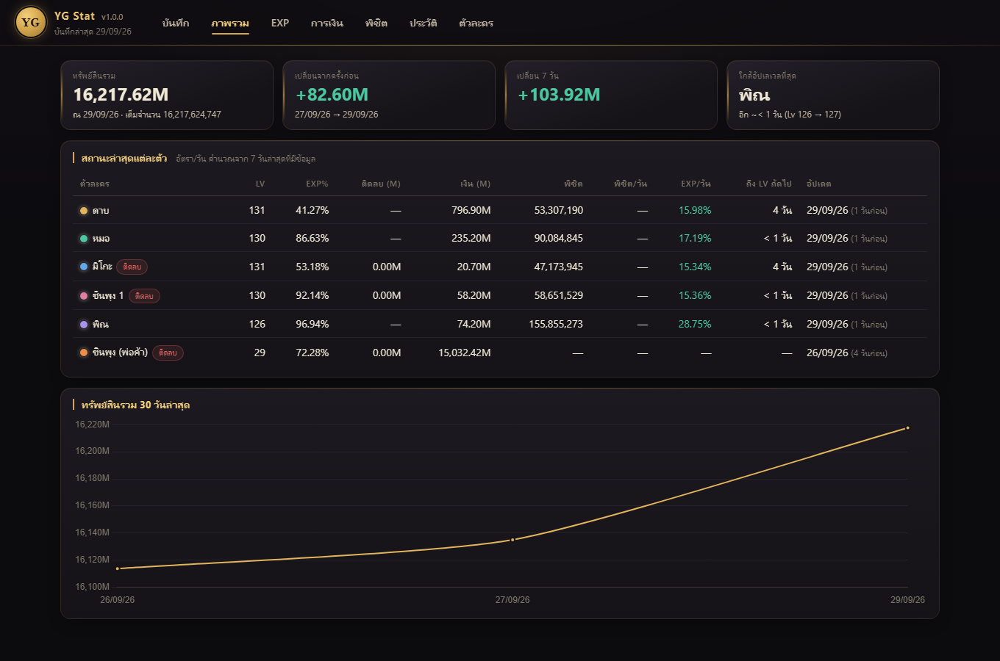
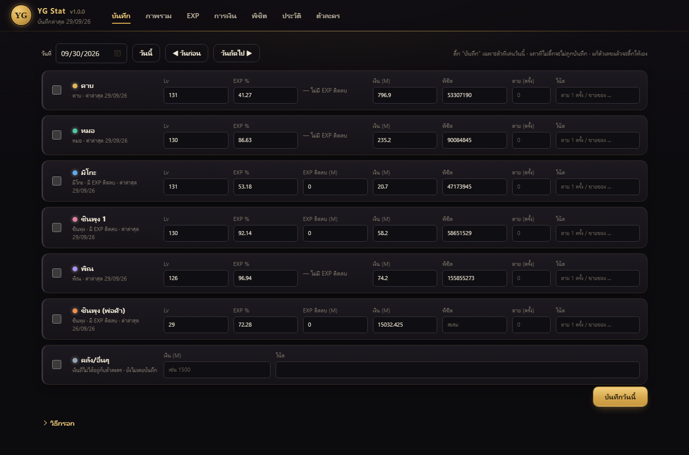
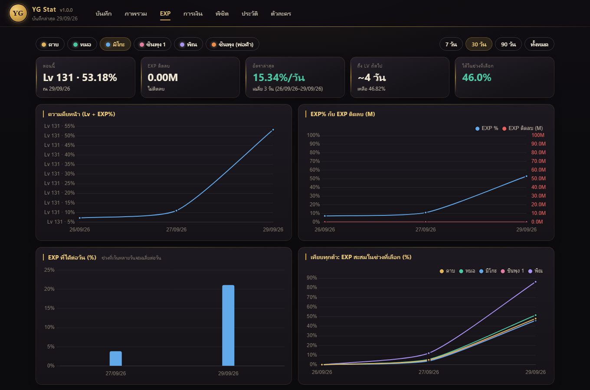
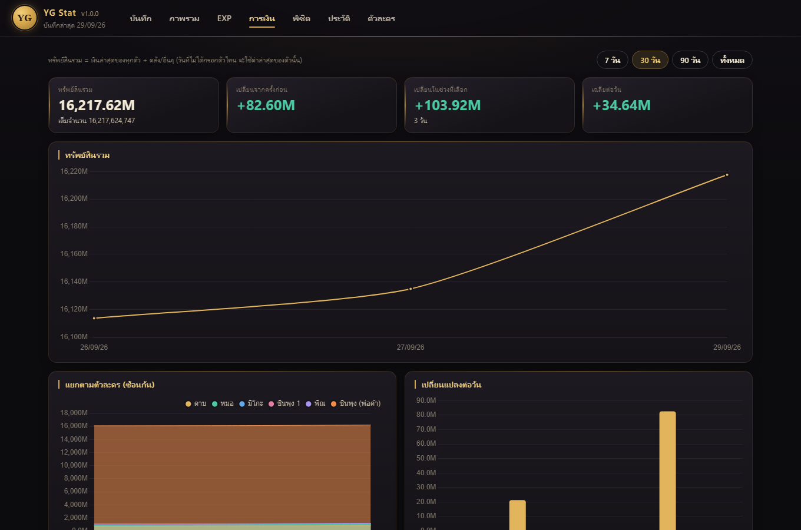
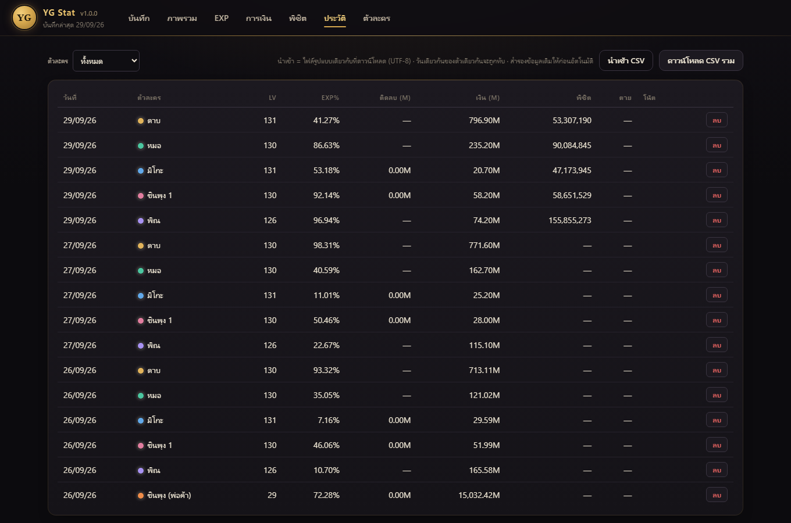

# YG Stat

ระบบบันทึก EXP / เงิน ของตัวละครโยวกัง แบบใส่มือวันละครั้ง แล้วดูกราฟวิเคราะห์ได้
ทำงานบนเครื่องตัวเอง ไม่ต้องติดตั้งอะไรเพิ่ม (Go binary ตัวเดียว + หน้าเว็บฝังอยู่ในตัว)



## หน้าจอ

| บันทึก | EXP |
|---|---|
|  |  |

| การเงิน | ประวัติ |
|---|---|
|  |  |

- **บันทึก** กรอกค่าวันละครั้ง ติ๊กเฉพาะตัวที่เล่น แถวที่มีข้อมูลวันนั้นแล้วขอบซ้ายเป็นสีเขียว แถวที่แก้แล้วยังไม่บันทึกเป็นสีทอง
- **ภาพรวม** ทรัพย์สินรวม สถานะล่าสุดทุกตัว เวลาถึงเป้าเลเวล และกราฟ 30 วัน
- **EXP / พิชิต** เลือกตัวละครและช่วงเวลา ดูอัตราต่อวัน เวลาถึงเลเวลถัดไป/เลเวลเป้าหมาย จำนวนครั้งที่ตาย และเทียบทุกตัว
- **การเงิน** ทรัพย์สินรวม แยกตามตัวละคร เปลี่ยนแปลงต่อวัน เงินที่ได้ต่อวันแยกรายตัว และเวลาถึงเป้าทรัพย์สิน
- **ประวัติ** ดูและลบรายการย้อนหลัง ดาวน์โหลด / นำเข้า CSV
- **ตัวละคร** จัดการตัวละคร ตั้งเป้าเลเวลรายตัว และเป้าทรัพย์สินรวม

เลขเวอร์ชันของโปรแกรมแสดงอยู่ข้างชื่อ “YG Stat” มุมซ้ายบน
ธีมเป็นโทนมืดสไตล์เกม (ทอง / หยก / แดง) ปรับได้ที่ `static/style.css` ผ่าน CSS variables ด้านบนไฟล์ แล้ว `build.bat` ใหม่

## สิ่งที่ต้องมี

| | ต้องมี | หมายเหตุ |
|---|---|---|
| ใช้งาน (โหลด `yg-stat.exe` จากหน้า Releases) | Windows + เว็บเบราว์เซอร์ (Edge / Chrome / Firefox) | ไม่ต้องติดตั้งอะไรเพิ่ม ไม่ต้องต่อเน็ต |
| build เอง | [Go](https://go.dev/dl/) 1.25 ขึ้นไป | ใช้ตอน build เท่านั้น ไม่มี dependency ภายนอก (standard library ล้วน) ไม่ต้องใช้ Node / Python / ฐานข้อมูล |

## ติดตั้งและใช้งาน

### แบบง่าย: โหลดไฟล์สำเร็จรูป (ไม่ต้องมี Go)

1. เข้าหน้า **Releases** ของ repo นี้ โหลด `yg-stat.exe` ของเวอร์ชันล่าสุด
   (Linux ใช้ `yg-stat-linux-amd64`, Mac ชิป Apple ใช้ `yg-stat-macos-arm64`)
2. วางไว้ในโฟลเดอร์ที่ต้องการ แล้วดับเบิลคลิก โปรแกรมจะเปิด http://127.0.0.1:8765 ในเบราว์เซอร์ให้เอง
   ครั้งแรก Windows อาจขึ้น “Windows protected your PC” เพราะไฟล์ไม่ได้เซ็นรับรอง กด *More info → Run anyway*
3. เข้าแท็บ **ตัวละคร** แก้ชื่อ/อาชีพให้ตรงกับของตัวเอง (ครั้งแรกจะมีตัวละครตัวอย่างให้ 6 ตัว) แล้วเริ่มกรอกที่แท็บ **บันทึก**
4. เลิกใช้ให้ปิดหน้าต่างดำ (หรือกด Ctrl+C)

อัปเดตเวอร์ชัน = โหลด `yg-stat.exe` ตัวใหม่มาทับตัวเก่า ข้อมูลในโฟลเดอร์ `data/` ข้าง exe ไม่ถูกแตะ

### แบบ build เอง

1. ติดตั้ง Go จาก https://go.dev/dl/ (ตัวติดตั้ง `.msi` กด Next จนจบ แล้วเปิด terminal ใหม่) ตรวจด้วย `go version`
2. ดาวน์โหลดหรือ clone โปรเจกต์นี้ (ไฟล์ `yg-stat.exe` และโฟลเดอร์ `data/` ไม่อยู่ใน repo)
3. ดับเบิลคลิก `run.bat` ครั้งแรกจะ build `yg-stat.exe` ให้เอง แล้วเปิดเบราว์เซอร์

```
build.bat      # build yg-stat.exe ใหม่ (หลังแก้โค้ดหรือไฟล์ใน static/) ใส่เลขเวอร์ชันจาก git tag ให้
run.bat        # รัน (build ให้ถ้ายังไม่มี exe) แล้วเปิด http://127.0.0.1:8765 ให้เอง
go test ./...  # รันเทสต์
```

บน macOS / Linux: `go build -o yg-stat . && ./yg-stat`

### ตัวเลือกตอนรัน

`yg-stat.exe -port 9000 -data D:\yg\data -no-browser`

| ตัวเลือก | ค่าเริ่มต้น | ความหมาย |
|---|---|---|
| `-port` | `8765` | พอร์ตของหน้าเว็บ เปลี่ยนเมื่อพอร์ตชนกับโปรแกรมอื่น |
| `-data` | `data/` ข้าง exe | โฟลเดอร์เก็บ CSV |
| `-no-browser` | ปิด | ไม่ต้องเปิดเบราว์เซอร์ให้อัตโนมัติ |
| `-backup-keep` | `14` | จำนวนชุดสำรองอัตโนมัติที่เก็บไว้ (`0` = ไม่สำรอง) |
| `-version` | | แสดงเลขเวอร์ชันแล้วจบ |

โปรแกรมเปิดรับเฉพาะ `127.0.0.1` (เครื่องตัวเองเท่านั้น) เครื่องอื่นในวงแลนเข้าไม่ได้

### ปัญหาที่เจอบ่อย

- **`go` is not recognized** ยังไม่ได้ติดตั้ง Go หรือยังไม่ได้เปิด terminal ใหม่หลังติดตั้ง
- **เปิดแล้วปิดทันที / `bind: Only one usage of each socket address`** พอร์ต 8765 ถูกใช้อยู่ (มักเป็น yg-stat ตัวเก่าที่ยังเปิดค้าง) ปิดตัวเก่า หรือรันด้วย `-port` อื่น
- **แก้ไฟล์ใน `static/` แล้วหน้าเว็บไม่เปลี่ยน** หน้าเว็บถูกฝังใน exe ต้อง `build.bat` ใหม่
- **แก้ CSV ด้วย Excel แล้วข้อมูลหาย** ต้องปิดโปรแกรมก่อนแก้ เพราะโปรแกรมเขียนทับทั้งไฟล์ทุกครั้งที่บันทึก
- **นำเข้า CSV แล้วขึ้นว่าไม่พบคอลัมน์ `date`** ไฟล์ไม่ได้เป็น UTF-8 ใน Excel ให้บันทึกเป็น *CSV UTF-8 (Comma delimited)*

## ข้อมูลและการสำรอง

ข้อมูลเก็บเป็น CSV ในโฟลเดอร์ `data/` ข้าง exe (เปิดด้วย Excel ได้)

| ไฟล์ | เก็บอะไร |
|---|---|
| `characters.csv` | ตัวละคร (ชื่อ, อาชีพ, มี EXP ติดลบไหม, ลำดับ, เปิดใช้, เป้าเลเวล) |
| `snapshots.csv` | บันทึกรายวัน 1 แถว/ตัว/วัน: Lv, EXP%, EXP ติดลบ (จำนวน EXP เต็ม), เงิน, โน้ต, ค่าพิชิตศัตรู (สะสม), จำนวนครั้งที่ตาย |
| `vault.csv` | เงินคลัง/ตัวฝากของ/อื่น ๆ รายวัน (นับรวมในทรัพย์สินรวม) |
| `settings.csv` | ค่าตั้ง เช่น เป้าทรัพย์สินรวม |
| `backups/` | ชุดสำรองอัตโนมัติ |

**สำรองอัตโนมัติ** โปรแกรมก๊อปไฟล์ทั้งหมดไว้ที่ `data/backups/<วันที่>/` วันละชุด ตอนเปิดโปรแกรมหรือก่อนแก้ไขข้อมูลครั้งแรกของวัน
(คือสถานะ “ก่อน” เริ่มแก้วันนั้น) และสำรองเพิ่มอีกชุดทุกครั้งก่อนนำเข้า CSV เก็บไว้ 14 ชุดล่าสุด ชุดเก่ากว่านั้นถูกลบเอง
**กู้คืน**: ปิดโปรแกรม ก๊อปไฟล์ `.csv` จากชุดที่ต้องการกลับมาทับใน `data/` แล้วเปิดใหม่

ชุดสำรองอยู่ในเครื่องเดียวกับข้อมูลจริง ถ้ากลัวดิสก์เสียให้ก๊อปโฟลเดอร์ `data/` ไปเก็บที่อื่นด้วยเป็นระยะ

**นำเข้า CSV** (แท็บประวัติ) รับไฟล์รูปแบบเดียวกับ “ดาวน์โหลด CSV รวม” อ่านตามชื่อคอลัมน์ ลำดับไม่สำคัญ

| คอลัมน์ | |
|---|---|
| `date`, `character` | ต้องมี วันที่รูปแบบ `YYYY-MM-DD` |
| `job`, `level`, `exp_pct`, `conquer`, `deaths`, `note` | ไม่บังคับ |
| `gold` หรือ `gold_m` | เงินเต็มจำนวน หรือหน่วยล้าน (ใส่อย่างใดอย่างหนึ่ง) |
| `debt` หรือ `debt_m` | EXP ติดลบเต็มจำนวน หรือหน่วยล้าน |

ตัวละครจับคู่ด้วยชื่อ ถ้าไม่มีจะสร้างให้ใหม่ · แถววันเดียวกันของตัวเดียวกันจะถูกทับ · แถวที่ `job` = `vault` คือเงินคลัง · แถวที่วันที่ผิดรูปแบบจะถูกข้าม

## แนวคิด

- **EXP ติดลบ** (มิโกะ, ชินพุง): ตายแล้ว EXP% ไม่ลด แต่ติดสถานะ EXP ติดลบเป็น **จำนวน EXP** (เช่น 500M)
  ระหว่างติดลบ EXP% ยังขึ้นอยู่ เพียงแต่ EXP ที่ได้ถูกแบ่งส่วนหนึ่งไปหักยอดติดลบ จึง **ไม่นำมาหักจากความคืบหน้า**
  ความคืบหน้า = Lv×100 + EXP% (ใช้คำนวณอัตรา/วัน และเวลาถึงเลเวลถัดไป) ส่วนยอดติดลบกรอก/แสดงแยกเป็นหน่วย M
  พร้อมอัตราใช้คืนต่อวันและจำนวนวันที่คาดว่าจะหมด (แท็บ EXP) อาชีพไหนเป็นแบบนี้ตั้งได้ในแท็บตัวละคร
- **ตาย (ครั้ง)** กรอกจำนวนครั้งที่ตายของวันนั้น (ไม่บังคับ) แท็บ EXP จะแสดงเป็นกากบาทบนกราฟ EXP ที่ได้ต่อวัน และรวมยอดในช่วงที่เลือก
- **เป้าหมาย** ตั้งเป้าเลเวลรายตัวและเป้าทรัพย์สินรวมได้ในแท็บตัวละคร
  เวลาถึงเป้าเลเวลคิดจากอัตรา %/วัน ล่าสุด โดยถือว่าทุกเลเวลใช้ EXP เท่ากัน เลเวลสูงขึ้นจริง ๆ จะช้าลง จึงควรมองเป็น “อย่างเร็วที่สุด”
  เวลาถึงเป้าทรัพย์สินคิดจากเงินเฉลี่ยต่อวันของช่วงที่เลือกในแท็บการเงิน
- **หน่วยเงิน**: หน้าจอแสดงและกรอกเป็น **M (ล้าน)** เช่น `713.11` = 713,110,000 แต่ในไฟล์ CSV เก็บเป็นเงินเต็มจำนวนเสมอ
  (ไฟล์ export มีคอลัมน์ `gold_m` / `debt_m` เพิ่มให้) กรอกเต็มจำนวนได้ด้วยการต่อท้าย `g` เช่น `713106021g`
- **ค่าพิชิตศัตรู** กรอกเป็นค่าสะสมที่เห็นในเกม ระบบคำนวณส่วนเพิ่มต่อวันเอง (แท็บ "พิชิต") แถวเก่าที่ไม่มีค่านี้จะเว้นว่างไว้ ไม่กระทบกราฟอื่น
- **ทรัพย์สินรวม** = เงินล่าสุดของทุกตัว + คลัง วันไหนไม่ได้กรอกตัวไหน ใช้ค่าล่าสุดของตัวนั้นแทน (forward-fill)
- **เงินที่ได้ต่อวันแยกรายตัว** คิดจากเงินของตัวนั้นที่เปลี่ยนไปในช่วงที่เลือก ถ้าโอนเงินข้ามตัว ตัวหนึ่งจะติดลบอีกตัวจะบวก (ยอดรวมไม่เปลี่ยน)
- บันทึกวันเดิมซ้ำ = ทับค่าเดิมของวันนั้น
- เปิดแท็บตรง ๆ ได้ด้วย URL: `/#overview` `/#exp` `/#money` และเลือกตัวละครในแท็บ EXP ด้วย `/?c=3#exp`

## เวอร์ชันและการออก release

ใช้เลขเวอร์ชันแบบ [Semantic Versioning](https://semver.org/lang/th/) `vMAJOR.MINOR.PATCH` และออก release อัตโนมัติด้วย GitHub Actions

ทุกครั้งที่มี commit เข้า `main` (push ตรงหรือเมิร์จ pull request) workflow [release.yml](.github/workflows/release.yml) จะ

1. รัน `go vet` + `go test`
2. คำนวณเลขเวอร์ชันถัดไปจากข้อความ commit ตั้งแต่ tag ล่าสุด ([scripts/next-version.sh](scripts/next-version.sh))
3. build `yg-stat.exe` (Windows), Linux, macOS โดยฝังเลขเวอร์ชันลงในโปรแกรม
4. สร้าง git tag + GitHub Release พร้อมไฟล์ที่ build, `checksums.txt` และ release notes ที่สรุปจาก commit/PR ให้เอง

เลขเวอร์ชันขึ้นตามคำนำหน้าข้อความ commit ([Conventional Commits](https://www.conventionalcommits.org/)):

| ข้อความ commit | ตัวอย่าง | เลขที่ขึ้น |
|---|---|---|
| `feat: ...` | `feat: เพิ่มกราฟเงินรายตัว` | MINOR (v1.2.3 → v1.3.0) |
| `fix: ...` หรืออื่น ๆ (`chore:`, `refactor:`, ไม่มีคำนำหน้า) | `fix: ETA ผิดตอนติดลบ` | PATCH (v1.2.3 → v1.2.4) |
| มี `!` หลัง type หรือมีบรรทัด `BREAKING CHANGE:` | `feat!: เปลี่ยนรูปแบบ CSV` | MAJOR (v1.2.3 → v2.0.0) |

release แรกจะเป็น `v1.0.0` · commit ที่แก้เฉพาะไฟล์ `.md` หรือ `docs/` ไม่ออก release
ถ้าเมิร์จ PR แบบ squash ให้ตั้งชื่อ PR ตามรูปแบบข้างบน เพราะชื่อ PR จะกลายเป็นข้อความ commit
pull request ทุกอันถูกตรวจด้วย [ci.yml](.github/workflows/ci.yml) (gofmt, vet, test, build) ก่อนเมิร์จ

build ในเครื่องด้วย `build.bat` จะได้เลขจาก `git describe` เช่น `v1.2.0-3-gabc1234` (3 commit หลัง v1.2.0) ถ้า build ด้วย `go build` เฉย ๆ จะแสดง `dev`

## โครงสร้าง

```
main.go        HTTP server + REST API (net/http, embed) + flags
store.go       โหลด/บันทึก CSV (in-memory, atomic write)
backup.go      สำรองข้อมูลอัตโนมัติรายวัน
import.go      นำเข้า CSV
store_test.go  เทสต์
static/        index.html, app.js, style.css (ธีม + tokens), vendor/chart.umd.min.js
scripts/       next-version.sh (คำนวณเลขเวอร์ชันถัดไป)
.github/       workflows: ci.yml (ตรวจ PR), release.yml (ออก release)
docs/          ภาพหน้าจอที่ใช้ใน README
```

API: `GET /api/state` · `POST /api/day` · `POST /api/characters` · `POST /api/settings` · `POST /api/import` ·
`DELETE /api/snapshots/{id}` · `DELETE /api/vault/{date}` · `DELETE /api/characters/{id}` · `GET /api/export.csv`

## Contributing

ยินดีรับทุกการมีส่วนร่วม ไม่ว่าจะเป็นแจ้งบั๊ก เสนอฟีเจอร์ แก้เอกสาร หรือส่งโค้ด

- **แจ้งบั๊ก / เสนอไอเดีย** เปิด Issue ได้เลย ถ้าเป็นบั๊กช่วยบอกเลขเวอร์ชัน (มุมซ้ายบนของหน้าเว็บ) ขั้นตอนที่ทำให้เกิด และแนบภาพหน้าจอถ้ามี
- **กติกาของเกมที่โปรแกรมยังคิดไม่ถูก** (เช่น อาชีพอื่นที่มี EXP ติดลบ หรือสูตรที่ต่างไปในบางเซิร์ฟเวอร์) บอกได้ใน Issue เช่นกัน
- **ส่งโค้ด**
  1. Fork แล้วแตก branch จาก `main`
  2. แก้โค้ด แล้วรัน `gofmt -w .` และ `go test ./...` ให้ผ่าน
  3. ถ้าแก้หน้าจอ ลองเปิดดูจริงด้วย `go run .` (ข้อมูลทดสอบแยกโฟลเดอร์ได้ด้วย `-data`)
  4. เปิด Pull Request เข้า `main` โดยตั้งชื่อตาม [รูปแบบ commit](#เวอร์ชันและการออก-release) เช่น `feat: ...` หรือ `fix: ...` เพราะใช้กำหนดเลขเวอร์ชันถัดไป

แนวทางของโปรเจกต์: ใช้ standard library ของ Go อย่างเดียว ไม่เพิ่ม dependency, หน้าเว็บเป็น JavaScript ธรรมดาไม่มีขั้นตอน build, ข้อมูลต้องยังเปิดอ่านได้ด้วย Excel และไฟล์ CSV เดิมของผู้ใช้ต้องใช้ต่อได้หลังอัปเดต

## License

[MIT](LICENSE) ใช้ แก้ไข และแจกจ่ายต่อได้อิสระ

ไลบรารีที่ฝังมาด้วย: [Chart.js](https://www.chartjs.org/) (MIT) ใน `static/vendor/`
